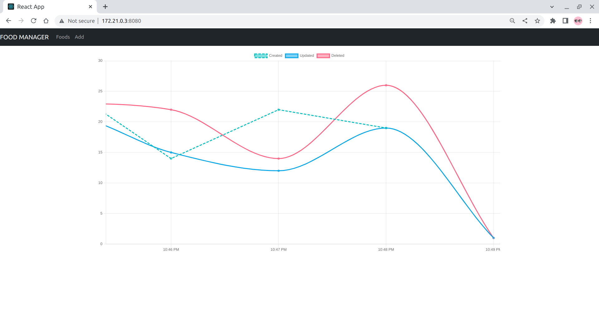
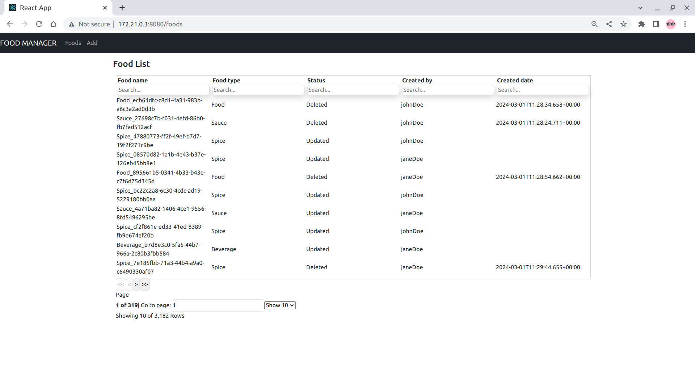
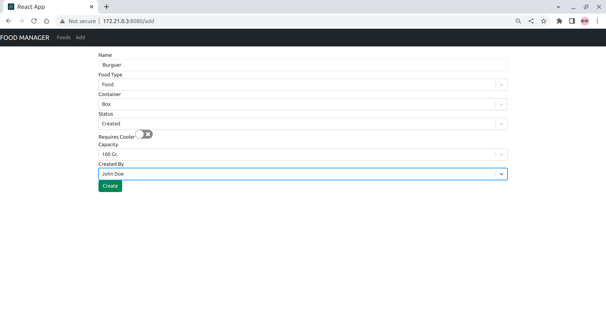

```
**********************************************************************************
 __   ___   __  ______              _   ___  ___                                  
\ \ / / | / /  |  ___|            | |  |  \/  |                                  
 \ V /| |/ /   | |_ ___   ___   __| |  | .  . | __ _ _ __   __ _  __ _  ___ _ __ 
  \ / |    \   |  _/ _ \ / _ \ / _` |  | |\/| |/ _` | '_ \ / _` |/ _` |/ _ \ '__|
  | | | |\  \  | || (_) | (_) | (_| |  | |  | | (_| | | | | (_| | (_| |  __/ |   
  \_/ \_| \_/  \_| \___/ \___/ \__,_|  \_|  |_/\__,_|_| |_|\__,_|\__, |\___|_|   
                                                                  __/ |          
                                                                 |___/                
**********************************************************************************
```       

## Introduction

YK Food Manager provides an easy-to-use, PoC web-application for managing and monitoring
groceries. It also includes a simulator for automatically add food into the system.  

The system has been implemented using the following stack of technologies:

* Spring Boot (Java)
* Postgresql
* ReactJS

## Pre-requisites
* JDK 17
* Docker. Refer to this documentation to install it: https://docs.docker.com/engine/install/
* Maven
* Build and install food simulator in docker. Head to the following [instructions](https://github.com/moon0cean/foodSimulator) for further information. 

## Installation
    
* Build
    - `mvn clean install`    
* Run  
    - `docker build --tag=food-manager:latest .` (required if used in docker compose)
    - `docker compose up`

## Datamodel
The datamodel is composed by several entities, Food entity being the central one.

TODO: insert ER diagram here

## Food API RESTful
Currently, the API supports de following operations:

*  `/foods/{id}` (**GET**): Fetches food from DB by a given id and returns a `Food` object in json notation
*  `/foods` (**POST**): Creates a food in DB and returns the id of the food that have been created   
*  `/foods/{id}` (**PUT**): Updates a food in DB for a given id and returns a `Food` object in json notation
*  `/foods/{id}` (**DELETE**): Soft deletes a food in DB by changing its status to `DELETED` for a given id and returns the id of the food that have been created


## Backend Webapp
Users can monitor food operations and create food through the backend.

* **Dashboard**  
Food operations are displayed in a real-time linear chart with an x-axis time by minutes.


* **Food list**
Food  are displayed in a table filtered by most relevant fields.


* **Food Creation**
Food can be manually submitted via a GUI form

